<div align="center">

# 🧠 منصة التقييم النفسي
## QuizApp - Psychological Assessment Platform

[](https://flutter.dev)
[](https://dart.dev)
[](LICENSE)
[](https://github.com)

### **منصة تقييم نفسي ذكية معتمدة على معايير عالمية**

*تقييم دقيق • تحليل ذكي • توصيات مخصصة*

[🚀 تجربة التطبيق](#-التثبيت-والتشغيل) • [📖 الوثائق](#-البنية-المعمارية) • [🤝 المساهمة](#-المساهمة-في-المشروع) • [📞 التواصل](#-التواصل-والدعم)

---

</div>

## 📖 نبذة عن المشروع

**QuizApp** هي منصة تقييم نفسي شاملة ومتطورة تجمع بين الدقة العلمية وسهولة الاستخدام. تم تطوير المنصة بناءً على أحدث المعايير النفسية العالمية لتوفير أداة موثوقة للتقييم الذاتي والفحص المبدئي للحالات النفسية والعصبية.

### 🎯 لماذا QuizApp؟

<table>
<tr>
<td width="33%" align="center">
<h4>🏆 معايير عالمية</h4>
<p>اختبارات معتمدة دولياً من منظمات نفسية رائدة</p>
</td>
<td width="33%" align="center">
<h4>🤖 تحليل ذكي</h4>
<p>خوارزميات متقدمة لتحليل النتائج وتقديم توصيات دقيقة</p>
</td>
<td width="33%" align="center">
<h4>🔒 خصوصية تامة</h4>
<p>بياناتك محمية بالكامل مع إمكانية الاستخدام دون تسجيل</p>
</td>
</tr>
<tr>
<td width="33%" align="center">
<h4>🌐 عربي 100%</h4>
<p>واجهة عربية كاملة مع خطوط احترافية</p>
</td>
<td width="33%" align="center">
<h4>📊 تقارير شاملة</h4>
<p>نتائج مفصلة مع رسوم بيانية ونصائح علاجية</p>
</td>
<td width="33%" align="center">
<h4>⚡ سريع ومجاني</h4>
<p>نتائج فورية ومجانية تماماً دون إعلانات</p>
</td>
</tr>
</table>

---

## ✨ المميزات الرئيسية

### 🔬 اختبارات نفسية معتمدة

<details>
<summary><b>📋 DASS-21 - مقياس الاكتئاب والقلق والإجهاد</b></summary>

- **المعيار**: Depression, Anxiety and Stress Scale
- **الأسئلة**: 21 سؤال مقسمة على 3 فئات
- **المدة**: 5-10 دقائق
- **التصنيف**: 5 مستويات (طبيعي → شديد جداً)
- **الدقة**: مُعتمد من الجمعية النفسية الأمريكية (APA)

**الفئات المقاسة:**
- 😔 الاكتئاب: تقييم الحالة المزاجية والدافعية
- 😰 القلق: قياس الاستثارة الفسيولوجية والخوف
- 😓 الإجهاد: تقييم التوتر والإرهاق النفسي

</details>

<details>
<summary><b>🧩 ASSQ - مقياس فحص طيف التوحد</b></summary>

- **المعيار**: Autism Spectrum Screening Questionnaire
- **الأسئلة**: 10 أسئلة تشخيصية
- **المدة**: 3-5 دقائق
- **التصنيف**: تقييم احتمالية وجود خصائص طيف التوحد
- **الدقة**: معتمد لدى المراكز الطبية المتخصصة

**المجالات المقاسة:**
- 💬 التواصل الاجتماعي
- 🔄 السلوكيات المقيدة والمتكررة
- 👂 الحساسية الحسية

</details>

### 🧠 تحليل ذكي متقدم

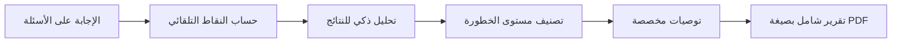

- ✅ **حساب تلقائي**: معالجة فورية للإجابات
- 📈 **تحليل متعدد المستويات**: تقييم شامل لكل فئة
- 🎨 **رسوم بيانية تفاعلية**: Charts.js لعرض بصري احترافي
- 💡 **توصيات ذكية**: اقتراحات علاجية بناءً على النتائج
- 📱 **تنبيهات**: إشعارات للحالات التي تحتاج متابعة طبية

### 🎨 تجربة مستخدم استثنائية

- **🌙 Dark Mode**: وضع ليلي مريح للعين
- **📱 Responsive Design**: يعمل بكفاءة على جميع الأحجام
- **✨ Animations**: رسوم متحركة سلسة باستخدام Flutter Animate
- **🎯 Intuitive Navigation**: تنقل سهل وبديهي
- **♿ Accessibility**: دعم كامل لميزات الوصول
- **🎨 Cairo Font**: خطوط عربية احترافية من Google Fonts

---

## 🖼️ معرض الصور

<div align="center">

### الصفحة الرئيسية والاختبارات

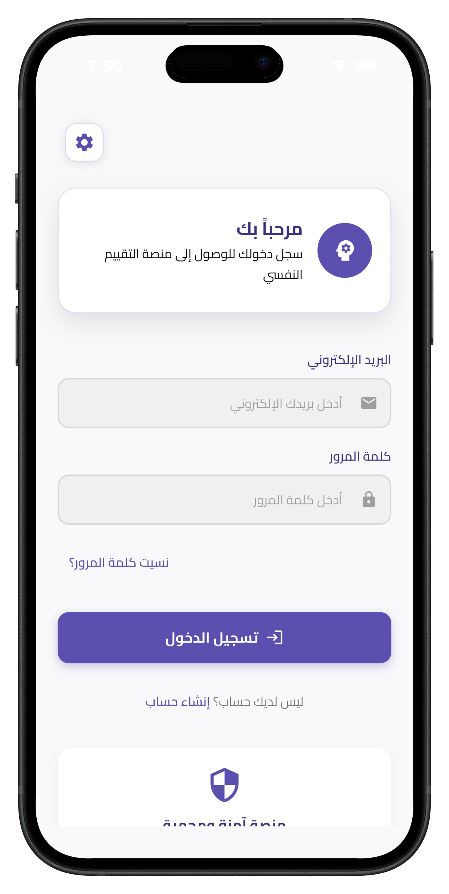 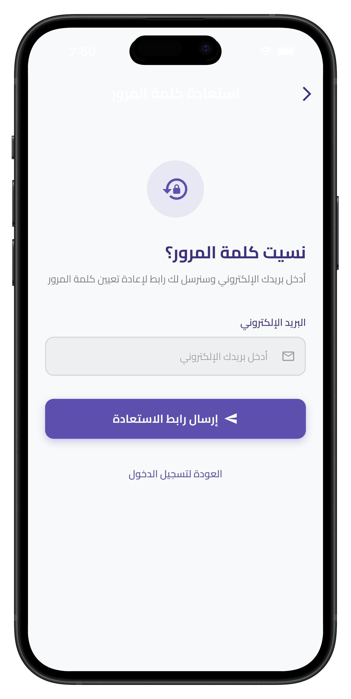 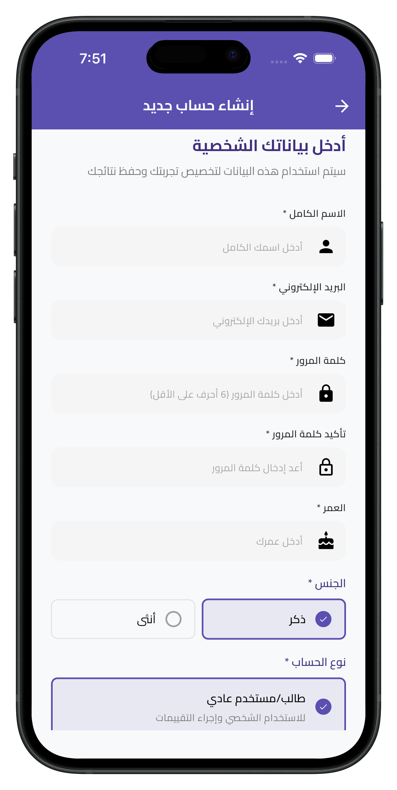

### عملية التقييم

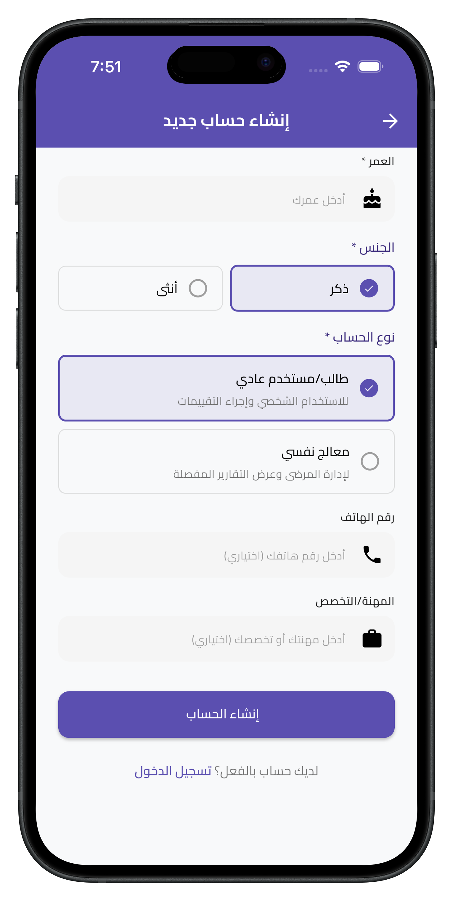 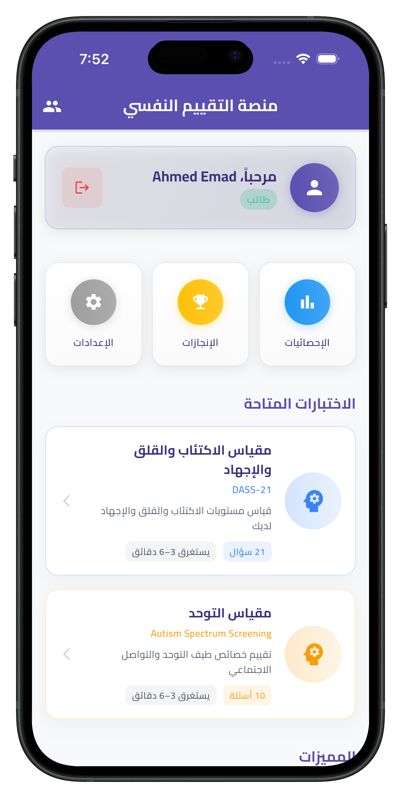 

### النتائج والتحليلات

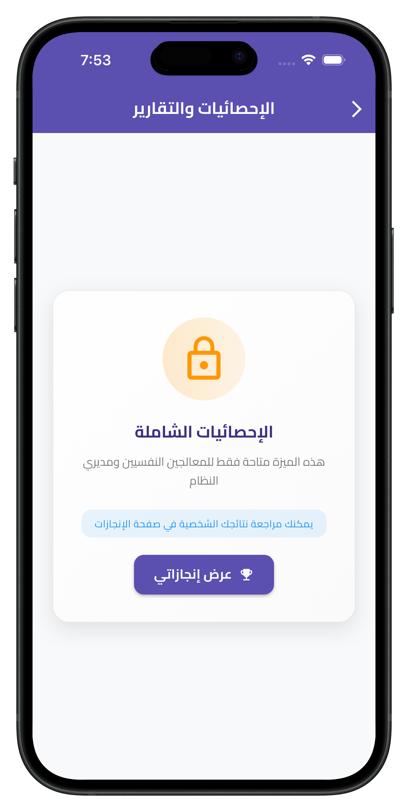 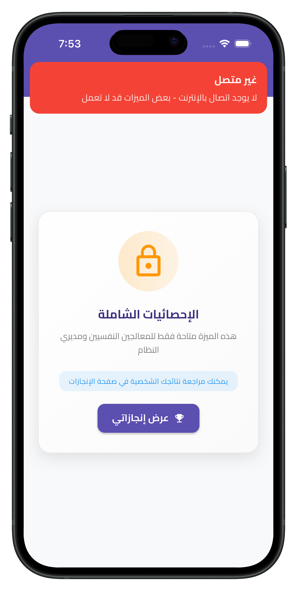 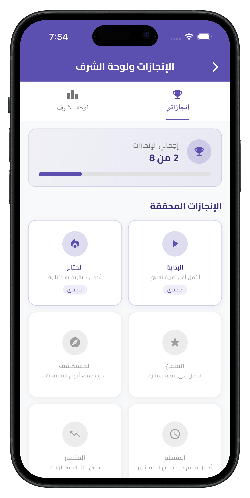

### تقارير مفصلة

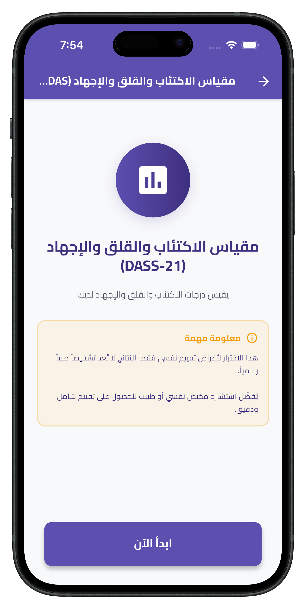  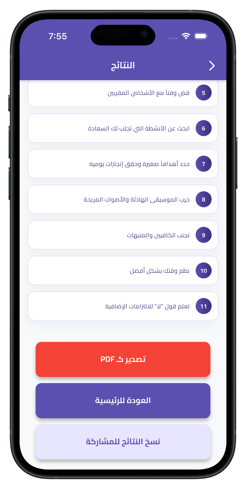

### ميزات إضافية

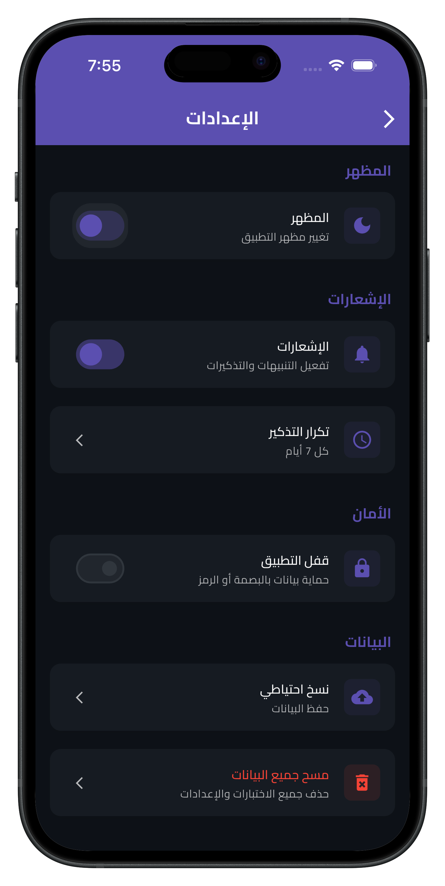 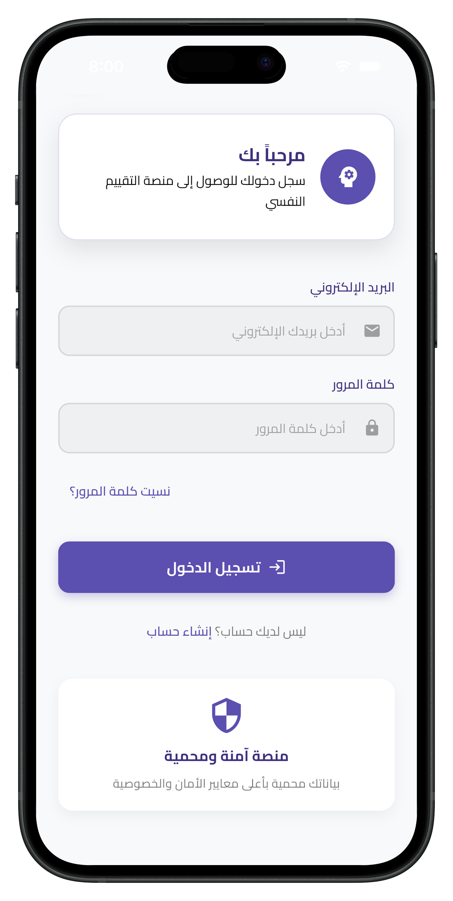 

</div>

---

## 🏗️ البنية المعمارية

### معمارية نظيفة ومنظمة (Clean Architecture + MVC)

```
📦 QuizApp/
┣ 📂 lib/
┃ ┣ 📄 main.dart                          # نقطة الدخول الرئيسية
┃ ┣ 📂 app/
┃ ┃ ┗ 📄 quiz_app.dart                   # تكوين التطبيق
┃ ┣ 📂 core/
┃ ┃ ┣ 📂 models/                         # نماذج البيانات
┃ ┃ ┃ ┗ 📄 assessment_model.dart        # نموذج التقييم
┃ ┃ ┣ 📂 data/                          # مصادر البيانات
┃ ┃ ┃ ┗ 📄 assessments_data.dart       # مكتبة الاختبارات
┃ ┃ ┣ 📂 services/                      # الخدمات
┃ ┃ ┃ ┗ 📄 assessment_analysis_service.dart  # خدمة التحليل
┃ ┃ ┣ 📂 features/                      # الميزات
┃ ┃ ┃ ┣ 📂 splash/                     # شاشة البداية
┃ ┃ ┃ ┃ ┣ 📂 controller/
┃ ┃ ┃ ┃ ┗ 📂 views/
┃ ┃ ┃ ┣ 📂 home/                       # الصفحة الرئيسية
┃ ┃ ┃ ┃ ┣ 📂 controller/
┃ ┃ ┃ ┃ ┗ 📂 views/
┃ ┃ ┃ ┣ 📂 assessment/                 # الاختبارات
┃ ┃ ┃ ┃ ┣ 📂 controller/
┃ ┃ ┃ ┃ ┗ 📂 views/
┃ ┃ ┃ ┃   ┣ 📄 assessment_screen.dart
┃ ┃ ┃ ┃   ┣ 📄 question_screen.dart
┃ ┃ ┃ ┃   ┗ 📄 results_screen.dart
┃ ┃ ┃ ┗ 📂 settings/                   # الإعدادات
┃ ┃ ┃   ┣ 📂 controller/
┃ ┃ ┃   ┗ 📂 views/
┃ ┃ ┣ 📂 router/                        # نظام التوجيه
┃ ┃ ┃ ┗ 📄 app_routes.dart
┃ ┃ ┣ 📂 styles/                        # الأنماط والألوان
┃ ┃ ┃ ┣ 📄 app_colors.dart
┃ ┃ ┃ ┗ 📄 app_text_styles.dart
┃ ┃ ┗ 📂 widgets/                       # الـ Widgets المشتركة
┃ ┃   ┣ 📄 custom_button.dart
┃ ┃   ┣ 📄 question_card.dart
┃ ┃   ┗ 📄 result_chart.dart
┣ 📂 assets/
┃ ┣ 📂 images/
┃ ┃ ┗ 📂 screenshots/
┃ ┗ 📂 fonts/
┃   ┗ 📄 Cairo-Regular.ttf
┣ 📄 pubspec.yaml                       # التبعيات والإعدادات
┗ 📄 README.md                          # هذا الملف
```

### 🔧 المكونات الأساسية

| المكون | الوصف | التقنية |
|--------|-------|---------|
| **State Management** | إدارة حالة التطبيق | GetX |
| **Routing** | التنقل بين الشاشات | GetX Navigation |
| **Data Storage** | تخزين النتائج | Firebase / Hive |
| **PDF Generation** | تصدير التقارير | pdf package |
| **Charts** | الرسوم البيانية | fl_chart |
| **Animations** | الحركات | Flutter Animate |

---

## 📊 المقاييس النفسية المدمجة

### 📈 DASS-21 Scale

<table>
<tr>
<th>الفئة</th>
<th>عدد الأسئلة</th>
<th>المدى</th>
<th>مستويات التصنيف</th>
</tr>
<tr>
<td><b>الاكتئاب</b></td>
<td>7 أسئلة</td>
<td>0-42</td>
<td>طبيعي (0-9) | خفيف (10-13) | معتدل (14-20) | شديد (21-27) | شديد جداً (28+)</td>
</tr>
<tr>
<td><b>القلق</b></td>
<td>7 أسئلة</td>
<td>0-42</td>
<td>طبيعي (0-7) | خفيف (8-9) | معتدل (10-14) | شديد (15-19) | شديد جداً (20+)</td>
</tr>
<tr>
<td><b>الإجهاد</b></td>
<td>7 أسئلة</td>
<td>0-42</td>
<td>طبيعي (0-14) | خفيف (15-18) | معتدل (19-25) | شديد (26-33) | شديد جداً (34+)</td>
</tr>
</table>

### 🧩 ASSQ Scale

| المجال | الوصف | نقاط التقييم |
|--------|-------|--------------|
| **التواصل الاجتماعي** | صعوبات التفاعل والتواصل | 0-3 نقاط/سؤال |
| **السلوكيات المقيدة** | الأنماط السلوكية المتكررة | 0-3 نقاط/سؤال |
| **الحساسية الحسية** | الاستجابة للمحفزات الحسية | 0-3 نقاط/سؤال |

**التفسير:**
- 0-15: غير محتمل وجود خصائص طيف التوحد
- 16-21: احتمالية منخفضة إلى متوسطة
- 22+: يُنصح بالاستشارة المتخصصة

---

## 🚀 التثبيت والتشغيل

### المتطلبات الأساسية

```bash
Flutter SDK: >=3.7.0
Dart SDK: >=3.0.0
Android SDK: API 21+
iOS: 12.0+
```

### خطوات التثبيت

1️⃣ **استنساخ المشروع**
```bash
git clone https://github.com/yourusername/quizapp.git
cd quizapp
```

2️⃣ **تثبيت التبعيات**
```bash
flutter pub get
```

3️⃣ **تشغيل التطبيق**
```bash
# Android
flutter run

# iOS
flutter run -d ios

# Web
flutter run -d chrome
```

4️⃣ **بناء الإصدار النهائي**
```bash
# Android APK
flutter build apk --release

# iOS
flutter build ios --release

# Web
flutter build web --release
```

---

## 🔧 التبعيات الرئيسية

```yaml
dependencies:
  flutter:
    sdk: flutter
  
  # State Management
  get: ^4.6.6
  
  # UI Components
  google_fonts: ^6.1.0
  flutter_animate: ^4.5.0
  
  # Charts & Graphs
  fl_chart: ^0.66.0
  
  # PDF Generation
  pdf: ^3.10.7
  printing: ^5.12.0
  
  # Storage
  firebase_core: ^2.24.2
  cloud_firestore: ^4.14.0
  hive: ^2.2.3
  hive_flutter: ^1.1.0
  
  # Utilities
  intl: ^0.18.1
  share_plus: ^7.2.1
```

---

## 🎯 حالات الاستخدام

### للأفراد
- 🏠 التقييم الذاتي المنزلي
- 📊 متابعة التحسن مع مرور الوقت
- 💡 فهم أفضل للصحة النفسية

### للمهنيين
- 👨‍⚕️ أداة فحص أولية في العيادات
- 📋 توثيق حالة المراجعين
- 📈 قياس فعالية العلاج

### للباحثين
- 🔬 جمع بيانات للدراسات
- 📊 تحليل الاتجاهات النفسية
- 📚 البحث العلمي

### للمؤسسات التعليمية
- 🎓 الإرشاد الطلابي
- 🏫 برامج الصحة النفسية
- 📚 التوعية النفسية

---

## ⚠️ إخلاء المسؤولية

> **تنويه مهم للغاية**

هذا التطبيق مصمم لأغراض **التوعية والتقييم المبدئي فقط**:

- ❌ **ليس بديلاً** عن التشخيص الطبي المتخصص
- ❌ **لا يقدم** علاجاً أو وصفات طبية
- ✅ **يجب استشارة** أخصائي نفسي معتمد للحصول على تقييم شامل
- 🚨 **في حالات الطوارئ**: اطلب مساعدة طبية فورية

### خطوط المساعدة في حالات الأزمات

- 🆘 الطوارئ النفسية: **[رقم هاتف محلي]**
- 📞 خط الدعم النفسي: **[رقم هاتف محلي]**
- 🌐 منصات الدعم: **[روابط مفيدة]**

---

## 🗺️ خارطة الطريق

### ✅ الإصدار الحالي (v1.0.0)
- [x] مقياس DASS-21
- [x] مقياس ASSQ
- [x] تقارير PDF
- [x] الوضع الليلي
- [x] دعم عربي كامل

### 🚧 قيد التطوير (v1.1.0)
- [ ] إضافة مقياس PHQ-9 (الاكتئاب)
- [ ] إضافة مقياس GAD-7 (القلق)
- [ ] سجل تاريخي للنتائج
- [ ] مقارنة النتائج عبر الزمن
- [ ] نظام التذكير بالفحوصات

### 🔮 المستقبل (v2.0.0)
- [ ] مساعد ذكي (AI Chatbot)
- [ ] تمارين الاسترخاء والتأمل
- [ ] مكتبة موارد نفسية
- [ ] مجتمع الدعم
- [ ] تكامل مع الأجهزة الذكية
- [ ] دعم لغات إضافية

---

## 🤝 المساهمة في المشروع

نرحب بمساهماتكم! 🎉

### كيف تساهم؟

1. 🍴 Fork المشروع
2. 🌿 أنشئ فرع جديد (`git checkout -b feature/amazing-feature`)
3. 💾 احفظ التغييرات (`git commit -m 'Add amazing feature'`)
4. 📤 ارفع التغييرات (`git push origin feature/amazing-feature`)
5. 🔃 افتح Pull Request

### مجالات المساهمة

- 🐛 **إصلاح الأخطاء**: تحسين استقرار التطبيق
- ✨ **ميزات جديدة**: إضافة مقاييس نفسية جديدة
- 📚 **التوثيق**: تحسين الوثائق والشروحات
- 🌍 **الترجمة**: إضافة دعم لغات جديدة
- 🎨 **التصميم**: تحسين واجهة المستخدم

### إرشادات الكود

- اتبع معايير Dart/Flutter الرسمية
- اكتب تعليقات واضحة بالعربية أو الإنجليزية
- أضف اختبارات للميزات الجديدة
- حافظ على نظافة وتنظيم الكود

---

## 📜 الترخيص

هذا المشروع مرخص تحت **رخصة MIT** - انظر ملف [LICENSE](LICENSE) للتفاصيل.

```
MIT License

Copyright (c) 2026 QuizApp Team

Permission is hereby granted, free of charge...
```

---

## 👥 الفريق

<table>
<tr>
<td align="center">

<br />
<sub><b>المطور الرئيسي</b></sub>
<br />
<a href="https://github.com/ahmedalaayq">GitHub</a>
</td>
<td align="center">

<br />
<sub><b>مستشار نفسي</b></sub>
<br />
<a href="#">Profile</a>
</td>
<td align="center">

<br />
<sub><b>مصمم UI/UX</b></sub>
<br />
<a href="#">Profile</a>
</td>
</tr>
</table>

---

## 📞 التواصل والدعم

### 📧 للاستفسارات والدعم
- **البريد الإلكتروني**: ahmed.alaayq@gmail.com
- **LinkedIn**: [AhmedAlaayq](https://www.linkedin.com/in/ahmed-alaayq-21a55b279/)

### 🐛 الإبلاغ عن المشاكل
وجدت مشكلة؟ [افتح Issue على GitHub](https://github.com/ahmedalaayq/quizapp/issues)


## 🌟 اعتمادات وشكر

شكر خاص لـ:

- 🙏 **المعاهد النفسية** التي وفرت المقاييس المعتمدة
- 💙 **مجتمع Flutter** على الدعم المستمر
- 🎨 **المصممون** الذين ساهموا في واجهة المستخدم
- 🔬 **الباحثون النفسيون** على مراجعة المحتوى العلمي

---

## 📊 إحصائيات المشروع

<div align="center">


</div>

---

<div align="center">

### 💙 صُنع بحب من أجل الصحة النفسية للجميع

**الإصدار**: 1.0.0 | **آخر تحديث**: فبراير 2026

[⬆ العودة للأعلى](#-منصة-التقييم-النفسي)

---

**هل أعجبك المشروع؟ ⭐ لا تنسى إضافة نجمة للمشروع!**

</div>